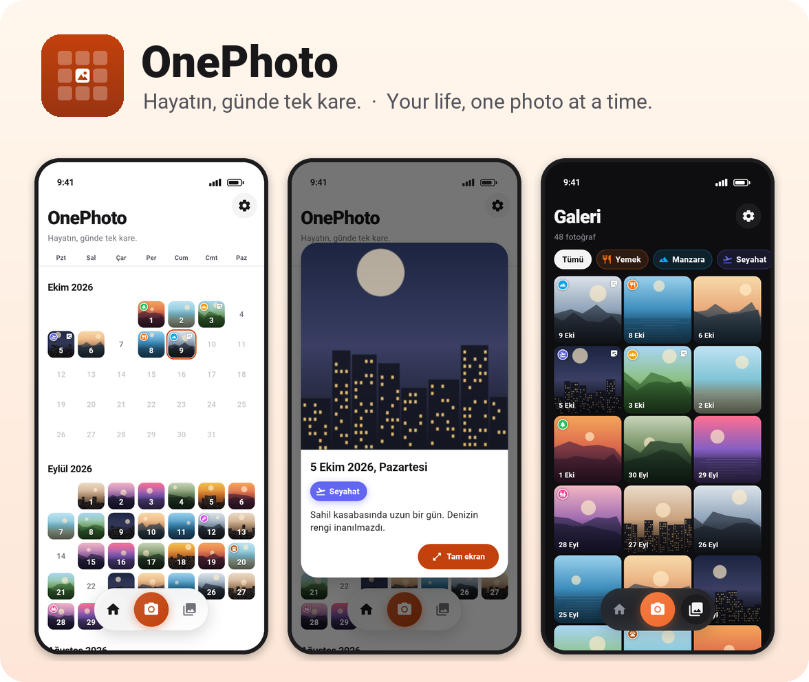
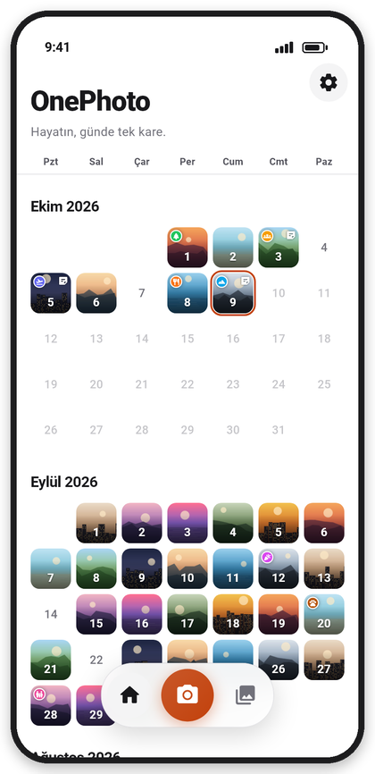
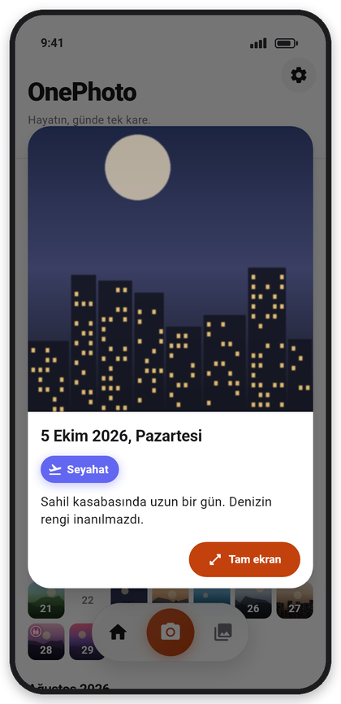
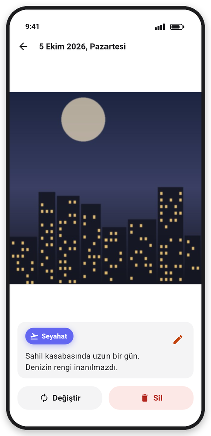
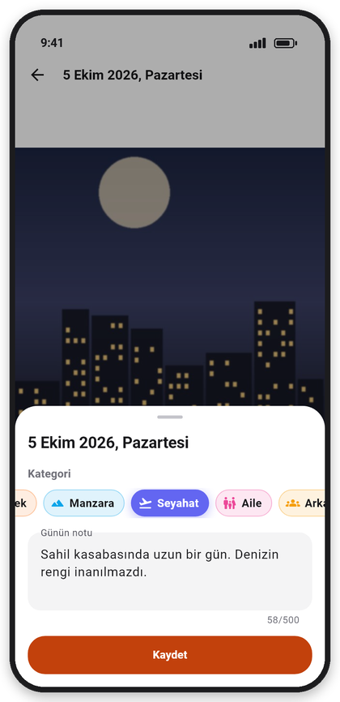
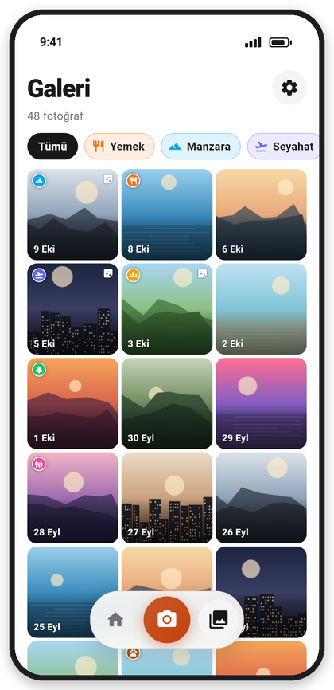
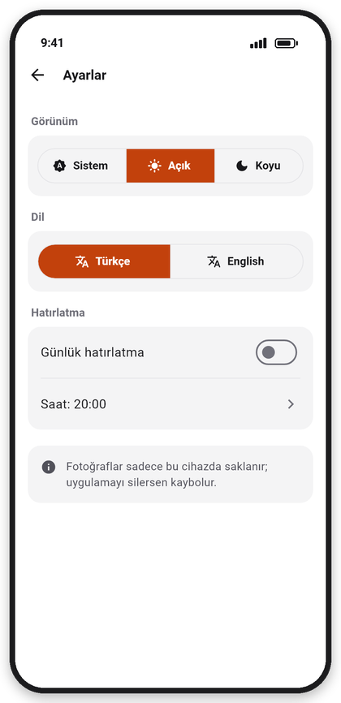
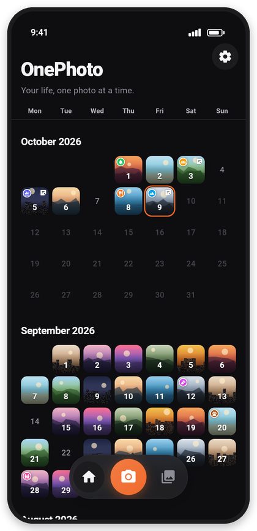
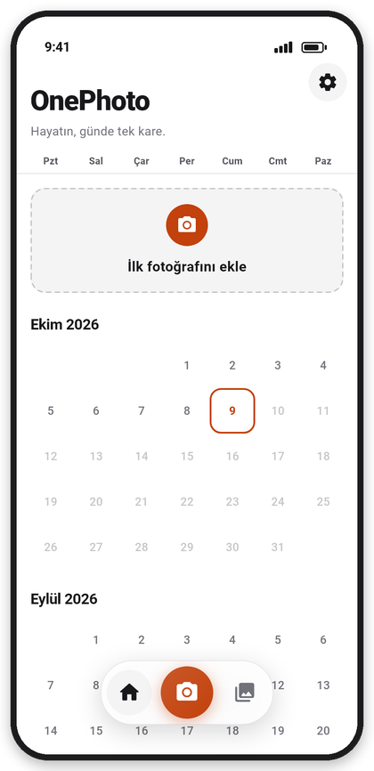

<p align="center">
  
</p>

<p align="center">
  <b>Her gün tek bir fotoğraf. Ay ay takvimde, hayatının görsel zaman çizelgesi.</b><br>
  Tamamen çevrimdışı · Hesap yok · Reklam ve analitik yok · Android & iOS
</p>

<p align="center">
  
  
  
  
  
</p>

---

## İçindekiler

- [Ekranlar](#ekranlar)
- [Özellikler](#özellikler)
- [Gizlilik ve veri](#gizlilik-ve-veri)
- [Kurulum ve geliştirme](#kurulum-ve-geliştirme)
- [Mimari](#mimari)
- [Testler ve kalite](#testler-ve-kalite)
- [Başarı ölçütleri](#başarı-ölçütleri)
- [Belgeler](#belgeler)

## Ekranlar

| Zaman çizelgesi | Gün önizlemesi | Tam ekran |
|:---:|:---:|:---:|
|  |  |  |
| Aylar en yeniden eskiye; bugün çerçeveli, gelecek günler soluk. Rozetler kategori ve notu gösterir. | Güne dokununca açılan salt okunur kart: fotoğraf, tarih, kategori, not. | 1x–4x yakınlaştırma, değiştir, sil; not ve kategori burada düzenlenir. |

| Kategori ve not | Galeri | Ayarlar |
|:---:|:---:|:---:|
|  |  |  |
| Simgeli, renkli 16 kategori ve 500 karakterlik günün notu. Fotoğraf ekledikten hemen sonra da açılır. | Tüm kareler 3 sütunlu ızgarada, kategoriye göre süzülebilir. | Sistem / Açık / Koyu tema, Türkçe / English, günlük hatırlatma. |

| Koyu tema | English | İlk açılış |
|:---:|:---:|:---:|
|  |  |  |

> Ekran görüntüleri uygulamanın kendisinden, gerçek fontlarla ve **örnek görsellerle** üretildi; hiçbir kişisel fotoğraf içermez.

## Özellikler

| | Özellik | Açıklama |
|---|---|---|
| 🗓️ | **Zaman çizelgesi** | Pazartesi başlayan 7 sütunlu ay ızgarası; en az son 12 ay, daha eski kayıt varsa onun ayına kadar. Yeni ay geldiğinde kendiliğinden eklenir. |
| 📷 | **3 dokunuşta bugünün karesi** | Alt çubuktaki kamera → deklanşör → onay. Boş geçmiş güne dokununca *Fotoğraf çek / Galeriden seç*. |
| 1️⃣ | **Günde tek fotoğraf** | Dolu güne yeni fotoğraf eklemeden önce onay sorulur; değiştirmede not ve kategori korunur. |
| 🔍 | **Önizleme ve tam ekran** | Önizleme kartı salt okunurdur; tam ekranda yakınlaştırma, değiştirme, silme ve düzenleme yapılır. |
| 🏷️ | **Kategoriler** | Yemek, Manzara, Seyahat, Aile, Arkadaşlar, Evcil hayvan, Doğa, Spor, İş, Okul, Kutlama, Aşk, Ev, Sanat, Müzik, Ben. Her birinin simgesi ve rengi var. |
| 📝 | **Günün notu** | 500 karaktere kadar not; hücrede ve galeride küçük not işareti. |
| 🖼️ | **Galeri** | Tüm fotoğraflar en yeniden eskiye kare ızgarada; kategori süzgeci. |
| 🌙 | **Koyu tema** | Sistemi izler ya da elle Açık/Koyu seçilir; geçiş animasyonludur. |
| 🌍 | **Türkçe / English** | Tüm metinler, ay/gün adları, tarih biçimi ve sistem diyalogları anında değişir. |
| 🔔 | **Günlük hatırlatma** | Seçilen saatte yerel bildirim (varsayılan kapalı, 20:00); yeniden başlatma sonrası için Android alıcısı kayıtlı. |
| ✨ | **Modern arayüz** | Buzlu cam efektli yüzen alt çubuk, küçülen büyük başlık, Hero geçişleri, sırayla beliren aylar ve kareler, basınca küçülme efekti. |

## Gizlilik ve veri

- **Ağ isteği yok.** Release APK'nın birleştirilmiş manifestinde `INTERNET` izni bulunmaz; analitik, reklam ya da çökme raporlama SDK'sı yoktur.
- Fotoğraflar uygulamanın özel klasörüne (`<belgeler>/photos/`) **kopyalanır**. Galerideki orijinal silinse de uygulamadaki kopya kalır; uygulama orijinallere dokunmaz.
- Veritabanı (`sqflite`, `one_photo.db`, şema v3) yalnızca **dosya adı** saklar, mutlak yol saklamaz; iOS'ta konteyner yolu değişse de fotoğraflar kaybolmaz.

  | Sütun | Tip | Not |
  |---|---|---|
  | `date_key` | TEXT, PK | Yerel saatle `YYYY-MM-DD`; UTC ya da EXIF kullanılmaz |
  | `file_name` | TEXT | `2026-10-09_1760000000000.jpg` |
  | `created_at` / `updated_at` | INTEGER | epoch ms |
  | `note` | TEXT? | v2 — günün notu |
  | `category` | TEXT? | v3 — kategori kimliği (`food`, `travel` …) |

- Şema geçişleri yalnızca sütun **ekler** (v1 → v2 → v3); mevcut kayıtlar ve dosyalar korunur.
- Açılışta hiçbir kaydın kullanmadığı dosyalar silinir (yetim temizliği). Değiştirme sırası **yeni dosya → veritabanı → eski dosya**dır, yarıda kalan işlem veri kaybettirmez.
- ⚠️ Yedekleme yoktur: uygulama silinirse fotoğraflar da silinir. Ayarlar ekranında bu uyarı gösterilir.

## Kurulum ve geliştirme

**Gereksinimler:** Flutter stable ≥ 3.35 (geliştirmede 3.47.5), Android SDK; iOS için macOS + Xcode.

```bash
flutter pub get
flutter run                    # debug
flutter run --profile          # performans ölçümü
flutter build apk --release    # build/app/outputs/flutter-apk/app-release.apk
```

Her değişiklikten sonra çalıştırılan doğrulama üçlüsü:

```bash
dart format --output=none --set-exit-if-changed . && flutter analyze && flutter test
```

Debug ve profile derlemelerinde Ayarlar'da **"365 günlük demo veri üret"** butonu vardır: en az bir fotoğraf varken onu kopyalayarak son 365 günün boşlarını doldurur. Release derlemede görünmez.

## Mimari

Katmanlar yalnızca aşağı doğru çağırır: `ui → state → services → data → core`. `core/` Flutter'a bağımlı değildir; somut bağımlılıklar `main.dart`'ta kurulur ve kurucularla aktarılır (singleton yok).

```
lib/
├── main.dart, app.dart        # bağımlılıklar, MaterialApp (tema + dil)
├── core/                      # gün anahtarı, takvim, kategoriler, metinler (TR/EN), tema
├── data/                      # Entry modeli, sqflite deposu, fotoğraf klasörü
├── services/                  # picker sarmalayıcısı, fotoğraf akışı, ayarlar, hatırlatma
├── state/                     # TimelineController, AppearanceController
└── ui/
    ├── timeline/              # ana ekran, ay ızgarası, gün hücresi, galeri
    ├── day_detail/            # önizleme kartı, tam ekran, not/kategori düzenleyici
    ├── settings/              # ayarlar
    └── widgets/               # alt çubuk, kategori çipleri, animasyonlar, ortak akışlar
```

| Paket | Kullanım |
|---|---|
| `sqflite` | Yerel veritabanı |
| `path_provider`, `path` | Belge klasörü ve dosya yolları |
| `image_picker` | Sistem kamerası ve galeri |
| `shared_preferences` | Tema, dil, hatırlatma ayarları |
| `flutter_local_notifications`, `timezone`, `flutter_timezone` | Günlük hatırlatma |
| `intl`, `flutter_localizations` | Türkçe/İngilizce tarih ve Material metinleri |

Durum yönetimi `ChangeNotifier` + `ListenableBuilder` ile yapılır; ek paket yoktur.

## Testler ve kalite

- **238 otomatik test**: birim (gün anahtarı, takvim, model, servisler), veritabanı (`sqflite_common_ffi`, şema geçişleri dahil) ve widget testleri (tüm ekranlar, TR/EN, açık/koyu tema).
- `flutter analyze` sıfır uyarı, `dart format` temiz.
- Gerçek cihazda (Xiaomi Poco X3, Android 12) kamera akışı, önizleme, düzenleme, galeri, tema ve dil elle doğrulandı.

## Başarı ölçütleri

Ölçüm: 2026-10-09, Xiaomi Poco X3 NFC (Android 12), profile APK.

| Ölçüt | Hedef | Sonuç |
|---|---|---|
| Bugünün fotoğrafı (bugün boşken) | ≤ 3 dokunuş | ✅ **3 dokunuş**; küçük resim ≤ 1,5 sn içinde hücrede |
| 365 fotoğrafla soğuk açılış | ≤ 2 sn | ✅ **1045–1195 ms** (5 ölçüm) |
| Ağ isteği yok | `INTERNET` izni yok | ✅ Yok (`POST_NOTIFICATIONS`, `RECEIVE_BOOT_COMPLETED`, `VIBRATE`) |
| Yalnızca onaylı paketler | ISKELET §3 | ✅ |

<details>
<summary>Soğuk açılışı yeniden ölçmek</summary>

```bash
flutter build apk --profile && adb install -r build/app/outputs/flutter-apk/app-profile.apk
# Ayarlar > "365 günlük demo veri üret" (önce bir fotoğraf ekle)
adb shell am force-stop com.muratefecamoglu.one_photo_app
adb shell am start -W -n com.muratefecamoglu.one_photo_app/.MainActivity   # TotalTime (ms)
```

</details>

## Belgeler

| Dosya | İçerik |
|---|---|
| [ISKELET.md](ISKELET.md) | Ürün tanımı, kapsam, kabul kriterleri (F1–F13), veri modeli, varsayımlar |
| [CLAUDE.md](CLAUDE.md) | Teknoloji yığını, komutlar, kod kuralları |
| [AGENT.md](AGENT.md) | Geliştirme ajanının çalışma kuralları |
| [PROGRESS.md](PROGRESS.md) | Aşama aşama ilerleme ve doğrulama kayıtları |
